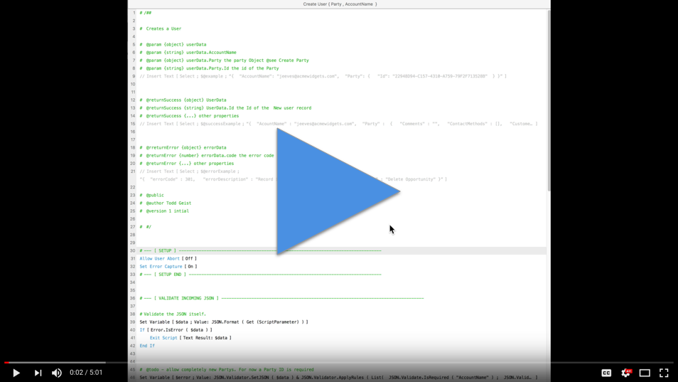

# fmdocs

**A guidline for documenting FileMaker Scripts and Functions**

FileMaker scripts and custom functions can get complex.  Now that we have JSON the data that gets passed in and out can get very complex and therefor focumenting what goes in and out of scripts can get tricky. We needed a way to clealy and consistantly document our FileMaker code as part of Karbon project.  This repo contains our current itteration on that thinking.

This is a living document. It will change as we get further in,

## Considerations
We didn't want to reinvent the wheel. We wanted someth that might lend itself to documentation generation. And we wanted it to be as easy as possible to read and to understand.

## Sources
We draw on [jsdoc](http://usejsdoc.org/) and [apidocs](http://apidocjs.com/) as primary material. We landed closer to jsdocs, but addopted some of the ideas from apidcos having to do with example inputs and results. Somebody who is familiar with either of those two style should have no problem understanding fmdocs.


## Example

Script: Create User ( {Party , AccountName} )
```
#/##
 
# Creates a User
 
# @param {object} userData
# @param {string} userData.AccountName
# @param {object} userData.Party the party Object @see Create Party
# @param {string} userData.Party.Id the id of the Party
// Insert Text [ $@example ] [ {"AccountName": "jeeves@acmewidgets.com""Party": {"Id":"22948D94-C157-4310-A759-79F2F713528B"}}]
 
 
# @returnSuccess {object} UserData
# @returnSuccess {string} UserData.Id the Id of the New user record
# @returnSuccess {...} other properties
// Insert Text [ $@successExample ] [ {"AcountName" : "jeeves@acmewidgets.com","Party" : {"Comments" : "", "ContactMethods" : []... ]
 
 
# @rreturnError {object} errorData
# @returnError {number} errorData.code the error code
# @returnError {...} other properties
// Insert Text [ $@errorExample ] [ {"errorCode" : 201,"errorDescription" : "Field cannot be modified","scriptName" : "Create User { Party , AccountName  }"} ]
 
# @public
# @author Todd Geist
# @version 1 intial working rev
 
# #/
```

## How It works

The "DocBlock" goes from "/##" to "/#".  This is a little different from the source specs since we are forced to use # on any line with a comment.

The first line, really anyline that doesn't have @tag is considered "Description". In the example above that is the line `# Creates a User`

Tags are denoted with "@". "@param" is a parameter. @returnSuccess is a succesful return value, @returnError is a return when there was an error.

The next value after the tag is the type. It goes inside a "{}"  The next word after that is the name of the thing.  Anything that follows is comments on that tag.


`@returnSucces` and `@returnError` follow the same pattern as @param. It's best to describe both error case and success case, if you have them. There are other tags such `@public` which are complete with out other attributes on the line. We use `{...}` to denote that there may be other properties on the object

### Examples
Examples are interesting. We needed a way to conveniently show the examples for parameters and results.  Writing complex JSON in FM Comments doesn't work very well. As an alternative we are using a commented out Insert Text Script step. These are perfect for writing long JSON strings as they will accept any text without concern for escaping.  The `@tag` is set as the target variable. When you click on them to expand them you get the full formatted version.

### Video Example


[](http://youtu.be/b4RIR_P1C3c "example")

## Custom Function Example

comming soon...

## Feedback

Please post questions or comments to the issue tracker
